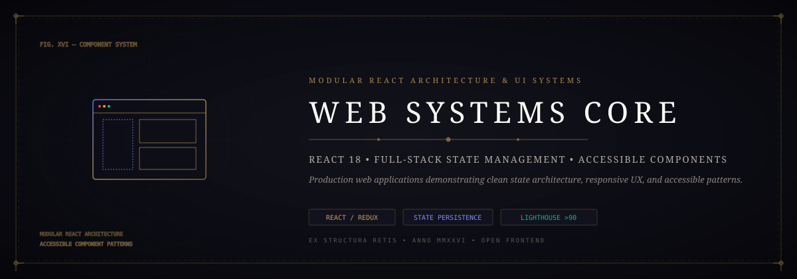
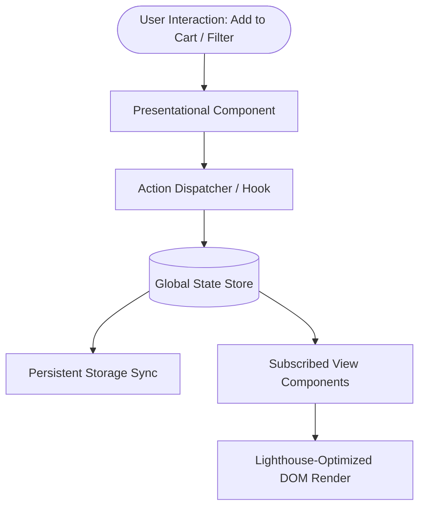

# 🌐 Web Systems Core: Modular Component Architecture & State Systems
### *Modern React 18, State Persistence, Accessible Patterns & Emil Kowalski Design Engineering*

*A clean full-stack web application showcasing modular component decomposition, persistent cart state, responsive layouts, and tactile micro-interactions.*

---

## ⚡ The Architectural Vision

Modern web development often suffers from bloated third-party dependencies, sluggish re-renders, and inaccessible component hierarchies.

**Web Systems Core** exemplifies clean frontend architecture:
- **Modular Component Decomposition**: Atomic design hierarchy separating presentational atoms from container state orchestrators.
- **Deterministic State Persistence**: Redux Toolkit / Context state synchronized with browser storage.
- **Emil Kowalski Tactile Feedback**: Physics-based `:active` scaling (`transform: scale(0.97)`), responsive easing curves (`cubic-bezier(0.23, 1, 0.32, 1)`), and zero layout-thrashing animations.

---

## 🏗️ State & Component Flow

---

## 🧩 Antigravity Skills & Tooling

- **`emil-design-eng`**: Tactile feedback, responsive custom easing curves, zero `transition: all`.
- **`react-best-practices`**: Memoized selectors and zero unnecessary parent re-renders.
- **`lighthouse-auditor`**: Enforcing >90 scores across Performance, Accessibility, and Best Practices.

---

## 📄 License

Distributed under the [MIT License](LICENSE). Maintained by [Jaswanth Reddy](https://github.com/Jaswanth1902) — *Passionate learner & creative problem solver learning from and giving back to the open-source community.*
